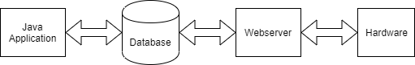

# JavaBasicCourse
- This is a final project about monitoring temperature and humidity, control led via a Java Application

# How does it work?

# Devices:
- Led
- Button
- NODEMCU
- DHT22

# Tools:
- Netbeans 8.2
- Arduino IDE 1.8.6
- XAMPP
